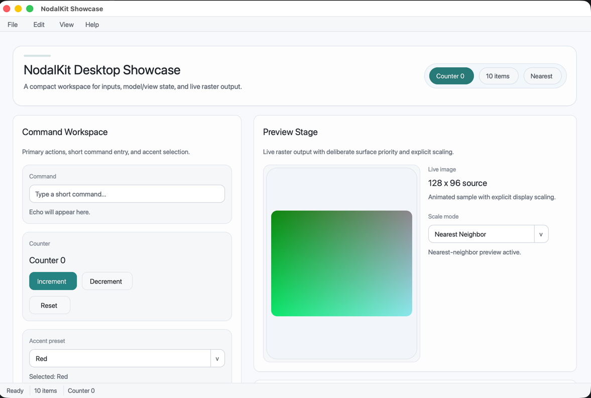

# NodalKit

[](LICENSE)
[](https://en.cppreference.com/w/cpp/23)
[](https://mesonbuild.com/)
[]()

A C++-first GUI toolkit for modern desktop applications.

NodalKit is an MIT-licensed alternative for C++ developers who might otherwise
reach for Qt, offering a GTK4-inspired architecture with a productive,
modern C++23 API. No meta-object compiler, no code generation, no build magic.



## Status

**0.1.0** — Early, but real. NodalKit already ships a working widget tree,
layout system, signals and properties, menus, dialogs, model/view primitives,
text shaping, examples, tests, and a built-in diagnostics/inspector stack. The
API and platform behavior are still unstable, and 0.x should be treated as a
rapidly changing toolkit rather than a compatibility promise.

The current 0.x support policy is:

- Linux Wayland is the primary release target.
- macOS is a secondary target while CI stays green.
- Windows is a secondary target (Win32, D3D11, DirectWrite/GDI).
- X11 is not a release target yet.

## Quick Start

```bash
# Requirements: Meson >= 1.10, a C++23 compiler
meson setup buildDir
meson compile -C buildDir
meson test -C buildDir
```

Install the SDK to a local prefix:

```bash
meson setup buildDir --prefix="$PWD/.local" --libdir=lib
meson compile -C buildDir
meson install -C buildDir
```

Consume the installed SDK through `pkg-config`:

```bash
export PKG_CONFIG_PATH="$PWD/.local/lib/pkgconfig"
pkg-config --cflags --libs nodalkit
```

Run the examples:

```bash
./buildDir/examples/hello_world
./buildDir/examples/counter
./buildDir/examples/showcase
```

The `showcase` example is the current best overview of the toolkit surface:
menus, layout, text entry, list/model behavior, image presentation, dialogs,
and status surfaces in one window.

For public best practices on building real applications with NodalKit, read
[docs/BUILDING_APPLICATIONS.md](docs/BUILDING_APPLICATIONS.md).

## Architecture at a Glance

| Module | Responsibility |
|--------|----------------|
| **foundation** | Types, Result, Signal/Slot, Property, Logging |
| **runtime** | Event loop, timers, task posting |
| **platform** | Application, Window, input events |
| **render** | Render node tree, software renderer, D3D11 on Windows, Metal on macOS, experimental Vulkan on Linux and Windows |
| **ui_core** | Widget base, tree, focus, state flags |
| **controllers** | Pointer, Keyboard, Focus controllers |
| **layout** | Measure/allocate pipeline, BoxLayout |
| **style** | CSS-like selectors, themes, tokens |
| **accessibility** | Roles, names, states (WAI-ARIA) |
| **model** | List models, selection, item factories |
| **widgets** | Label, Button, TextField, ScrollArea, ListView, Dialog, ComboBox, ImageView, MenuBar, StatusBar |
| **actions** | Named actions, shortcuts, action groups |

## Counter Example

```cpp
#include <nk/layout/box_layout.h>
#include <nk/platform/application.h>
#include <nk/platform/window.h>
#include <nk/ui_core/widget.h>
#include <nk/widgets/button.h>
#include <nk/widgets/label.h>

int main(int argc, char** argv) {
    nk::Application app(argc, argv);
    nk::Window window({.title = "Counter", .width = 420, .height = 220});

    int count = 0;
    auto label = nk::Label::create("0");
    auto button = nk::Button::create("Increment");

    auto conn = button->on_clicked().connect([&] {
        label->set_text(std::to_string(++count));
    });

    auto root = /* vertical box container */;
    root->append(label);
    root->append(button);

    window.set_child(root);
    window.present();
    return app.run();
}
```

## Design Highlights

- **Type-safe signals** via C++23 templates — no MOC, no macros
- **Property binding** with change notification
- **GTK4-style layout** — measure/allocate with pluggable layout managers
- **CSS-like theming** — selectors, style classes, pseudo-states, tokens
- **Accessibility model** — WAI-ARIA roles and states (platform bridges planned)
- **Async dialogs** — non-blocking `present()`, response via signals
- **Model/view** — `AbstractListModel` + `SelectionModel` + `ItemFactory`
- **Built-in diagnostics** — widget tree inspector, frame timeline, trace export, render snapshots

## Author

**Aleksandr Pavlov** — [ckidoz@gmail.com](mailto:ckidoz@gmail.com)

## License

MIT. See [LICENSE](LICENSE).
